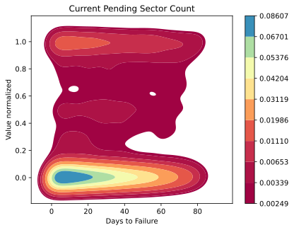

## 基于随机森林算法的硬盘故障预测

陈泱宇 20221401001z@stu.cqu.edu.cn (cyy@stu.cqu.edu.cn)

### 摘要

在数据中心中，硬盘失效在所有硬件失效中占据了最大的比重，而数据丢失将造成难以估量的损失。然而，尽管有 S.M.A.R.T. 等技术用于监视硬盘的工作状态以及错误信息，仍然需要一种用于运维人员评估哪些硬盘可能需要进行更换，以及哪些硬盘需要优先进行更换的算法，以降低数据丢失的风险，提高数据中心的存储可靠性。

本文参考了一些已有的大数据分析工作，尝试使用随机森林分类器对来自Backblaze数据中心的硬盘状态数据集进行挖掘，训练了一个在只得知当天硬盘 S.M.A.R.T. 信息的情况下能够分类硬盘正常、可能在20天内发生故障、可能在2天内发生故障的分类器来对硬盘故障进行预测。实验结果表明，该预测器达到了85.5%的分类准确率，90.0%的故障被正确预测，81.5%的故障硬盘能够被预测到。

关键词：随机森林、故障预测、S.M.A.R.T.

 ### 引言

在当下的大数据时代，硬盘作为一种存储介质存储了大量的具有价值的数据。然而，有关于数据中心硬件失效的调查数据显示，硬盘的失效率占所有硬件失效率的81.84%。[1] 且根据Backblaze的2023年第一季度的硬盘调查数据显示，硬盘的年故障率达到了1.54%。[2] 因此，硬盘作为数据中心中故障率最高的硬件，对其故障的发生进行预测可以有效降低数据丢失的风险，降低宕机时间，提高数据中心业务的可靠性。

尽管已有RAID等技术为硬盘提供冗余，并已在几乎所有服务器场景中得到使用，其保证一个阵列组中即使部分硬盘损坏，只要损坏的数量不超过RAID类型的容错上限，其数据完整性就可以得到保障。但即使这样，依然不可避免硬盘没能及时更换或在更换硬盘重建期间新的硬盘损坏。

鉴于硬件的可靠性问题难以避免，那么可以试图通过硬盘提供的统计数据来检查硬盘的健康状态，而 S.M.A.R.T. 技术正好解决了这个痛点。[3] S.M.A.R.T. ，它的全称是Self-Monitoring, Analysis and Reporting Technology，它允许硬盘内部对其运行状态的统计数据进行监测，这些数据包括了温度、电源开启次数、电源开启小时数、寻道错误率、重分配扇区数等数据，并可以由用户的应用程序访问。这些数据对运维人员了解硬盘的健康状态至关重要。例如当硬盘出现不稳定扇区或出现ECC校验失败的扇区时，则说明硬盘盘片可能已经老化或磁头已经磨损，出于数据安全考虑应该进行硬盘的更换。

而正是有了S.M.A.R.T技术，让硬盘故障的预测成为可能。除了其数值本身带来的警告外，我们还可以通过一些硬盘故障的历史数据集来分析，以便在硬盘可能出现异常情况时尽早进行预测，尽早进行更换，防止数据丢失带来巨大的损失。正好，Backblaze提供了这样的数据集[4]，它自身作为一家云存储服务提供商，也收集了其自身数据中心的硬盘每天的S.M.A.R.T数据以及其是否失效的标记，因此我们可以利用这个数据对硬盘的故障进行预测。

### 数据集介绍

本次选择的数据集来自Backblaze，它本身是一家云存储服务提供商，其自身的数据中心有大量的硬盘，他们每天收集这些硬盘的 S.M.A.R.T. 数据以及硬盘失效与否，并每个季度公开至互联网，我们选用Backblaze的2023年第一季度的数据集，共计包含21455082条数据。[4]

它的数据集包含了以下字段：

| 字段名               | 类型   | 描述                             |
| -------------------- | ------ | -------------------------------- |
| date                 | 日期   | 硬盘的状态记录日期               |
| serial_number        | 字符串 | 硬盘序列号                       |
| model                | 字符串 | 硬盘型号                         |
| capacity_bytes       | 整数   | 硬盘容量（字节）                 |
| failure              | 布尔   | 硬盘是否失效（损坏）             |
| smart_1_normalized   | 数值   | 硬盘smart id 1的数值（归一化）   |
| smart_1_raw          | 数值   | 硬盘smart id 1的数值（原始值）   |
| ....                 |        |                                  |
| smart_255_normalized | 数值   | 硬盘smart id 255的数值（归一化） |
| smart_255_raw        | 数值   | 硬盘smart id 255的数值（原始值） |

其中，硬盘的 S.M.A.R.T. ID对应不同的意义，选取一部分如下：

| ID   | 描述                 |
| ---- | -------------------- |
| 5    | 重分配扇区次数       |
| 187  | 无法修正的错误次数   |
| 188  | 命令超时次数         |
| 197  | 当前不稳定扇区数     |
| 198  | 不可修正错误的扇区数 |

之所以选择这部分ID是参考了[10]的结果，我们将在后文中基于这部分 S.M.A.R.T. 参数的子集用于硬盘故障预测。

### 数据集清洗与观察

我们首先对数据集进行了清洗操作，清洗的过程包括删除不关心的字段，最终只留下以下字段：

| 字段名         | 类型   | 描述                 |
| -------------- | ------ | -------------------- |
| date           | 日期   | 硬盘的状态记录日期   |
| serial_number  | 字符串 | 硬盘序列号           |
| model          | 字符串 | 硬盘型号             |
| capacity_bytes | 整数   | 硬盘容量（字节）     |
| failure        | 布尔   | 硬盘是否失效（损坏） |
| smart_5_raw    | 整数   | 重分配扇区次数       |
| smart_187_raw  | 整数   | 无法修正的错误次数   |
| smart_188_raw  | 整数   | 命令超时次数         |
| smart_197_raw  | 整数   | 当前不稳定扇区数     |
| smart_198_raw  | 整数   | 不可修正错误的扇区数 |

然后，我们观察到数据集中存在部分硬盘出现失效字段为真，但在往后的日期又变为假的情况，因此在数据集清洗过程中，我们通过序列号标识这个硬盘，并移出数据集。

接着，我们对所有发生过失效的硬盘的历史 S.M.A.R.T. 值按照该硬盘该项出现的最大值进行归一化后作为y轴，以硬盘距离失效的时间作为x轴，绘制了频谱图进行观察。通过观察发现，在硬盘即将失效前， S.M.A.R.T. 中部分参数的值会出现升高的变化，结果如下：

通过观察可以发现， S.M.A.R.T. 中的许多数值在硬盘失效前大约2天、20天的时间左右出现了明显的变化，这一观察帮助我们确定了进行故障检测的预测的分类范围。

### 算法介绍

#### 随机森林分类器

本文中，我们采用随机森林分类器[5]进行实现。代码实现基于scikit-learn [6] Python框架。

随机森林是一种集成学习算法，它于1995年由贝尔实验室的何天琴所提出，常用于解决分类和回归问题。它结合了决策树和随机性的概念，能够处理高维数据和大量样本。随机森林通过构建多个决策树来进行预测，并利用投票或平均值来确定最终的输出结果。

在训练随机森林时，首先从原始数据集中随机选择一部分样本，这个过程称为自助抽样（bootstrap sampling）。然后，对每个抽样集构建一个决策树，这些决策树可以并行构建，互相独立。在构建每个决策树时，对于每个节点的划分，随机选择一个特征子集，然后从该子集中选择最优的特征进行划分，从而保证了每个决策树的多样性和随机性。

在具体算法上，随机森林的训练是将Bagging算法 [7] 应用到树学习中。给定训练集X与目标Y，Bagging算法将从训练集X中进行B次有放回地采样，以此训练树模型。

在训练结束后，对样本x的预测通过对x上所有单个回归树的预测求平均来实现：

$$ \hat{f} = \frac{\sum_{b=1}^Bf_b (x')}{B}  $$

此外，所有单个回归树的预测的标准差可以作为预测的不确定性的估计：

$ \sigma = \sqrt{\frac{\sum_{b=1}^B (f_b(x')  - \hat{f})^2}{B-1} } $

由此Bagging算法相比直接使用单一的决策树降低了方差，从而带来了更好的性能。而随机森林则是在Bagging算法的基础上在学习过程中的每次候选分裂中选择特征的随机子集。这样做的原因是自助抽样导致的树的相关性，当部分特征与预测目标的相关性很强，则这些特征会被许多树所选择，导致树之间存在强相似性。随机森林论文中分析了不同条件下Bagging和随机子空间投影对精度提高的影响。[5]

当进行预测时，每个决策树会对输入样本进行分类或回归预测。对于分类问题，随机森林采用投票的方式，每个决策树投票选择最多的类别作为最终的预测结果。对于回归问题，随机森林将每个决策树的预测结果进行平均，得到最终的回归结果。

随机森林具有以下几个优点：首先，它在处理高维数据和大样本时表现出色，能够处理大规模的数据集。其次，它能够自动选择特征的重要性，通过计算每个特征的重要性指标，可以评估特征对于预测的贡献程度。此外，随机森林对于缺失数据和噪声具有一定的鲁棒性，也已经有相关工作验证随机森林算法对硬盘故障预测的准确性。[8] [9]

#### 数据预处理

我们首先对清洗后数据集进行了预处理操作。清洗过程已在前文所介绍。由于我们的计算过程在处理中对记录进行分类，因此在预处理之前需要先定义我们对数据需要识别的目标类型。

根据前文的硬盘失效前各 S.M.A.R.T. 属性值变化的观察结果，我们选择定义3种类型，如下表所示。

| 类型ID | 含义                 |
| ------ | -------------------- |
| 0      | 硬盘正常             |
| 1      | 硬盘可能在20天内失效 |
| 2      | 硬盘可能在2天内失效  |

然后，我们对数据中出现的硬盘失效字段为1的硬盘的序列号进行筛选，并根据该序列号建立字典对硬盘的失效时间进行索引，从而在后续遍历所有存在的失效记录时能够以 $O(log(n))$  的时间复杂度完成失效时间的查询，其中n为失效硬盘的数量。在完成存在失效的硬盘的筛选与失效时间字典的建立后，我们将数据集中 failure 列，也就是原本使用布尔值表示硬盘在当天是否失效的列，通过计算每条记录的时间对应该硬盘序列号（SN）的失效时间差，将其定义修改为我们所定义的类型。

至此，我们就完成了数据的预处理操作。

#### 数据集划分

由于我们的数据集是所有硬盘的历史记录，因此需要将他们划分为训练集与测试集，并保证训练集与测试集不能交叉。鉴于我们分析的数据是一种时间序列数据，因此不能直接将数据记录直接抽取为训练集与测试集，否则会导致故障硬盘本身的相邻时间的记录同时出现在训练集和测试集中，导致不能反映真实的情况。而我们的数据集中记录了每个硬盘的序列号（SN），通过序列号来划分训练集与测试集即可避免该情况。

与此同时，划分数据集时还需要考量不同识别类型之间的平衡问题。我们考虑了两种平衡方式，一种是每个识别类型（即硬盘正常、20天内失效、2天内失效，共3种）的数量在数据集中相同，另一种是可能失效的硬盘与正常硬盘的数量平衡。基于评估发现，由于我们采用的时间序列模型本身存在硬盘可能在20天内失效的数据数量多于硬盘可能在2天内失效的数据数量，因此我们认为在进行重采样时，使用可能失效的硬盘与正常硬盘的数量平衡更加符合实际情况。

### 实验评估

我们在使用 Random Forest Classifier 的情况下，使用3个识别目标类型（硬盘正常，硬盘可能在20天内损坏，硬盘可能在2天内损坏），对训练集数据进行了测试。在评价指标上，我们考虑3个指标，分别是准确率（测试集中分类正确的概率），预测故障成功率（测试集中硬盘故障被预测成功的概率，但具体的类型不一定能正确预测），召回率（实际会在未来发生故障的硬盘中在对应的时间点预测到故障发生时间的概率）。

我们使用不同的识别目标类型进行了测试，结果如下：

其中，括号内的数字表示预测的类型为距离硬盘失效在多少天内，2均分表示将数据进行采样时仅考虑正常硬盘与可能的失效的硬盘采用相同的数量，全均分表示每种识别的类型都采用相同的数量。其中，该算法表现最好的场景是基于3种分类（硬盘正常、20天内失效、2天内失效），并对数据集的采样只要求失效硬盘记录数量与正常硬盘数量一致。在这样一种场景下，最终达到了85.5%的分类准确率，90.0%的故障被正确预测，81.5%的故障硬盘能够被预测到（召回率）。

### 总结

本文尝试将随机森林算法用于基于硬盘 S.M.A.R.T. 信息的故障预测，并在预测硬盘是否正常，是否20天内失效、是否2天内失效这3种类别上达到了85.5%的分类准确率以及81.5%的召回率。

## 参考文献

1. G. Wang, L. Zhang and W. Xu, "What Can We Learn from Four Years of Data Center Hardware Failures?," *2017 47th Annual IEEE/IFIP International Conference on Dependable Systems and Networks (DSN)*, Denver, CO, USA, 2017, pp. 25-36, doi: 10.1109/DSN.2017.26.
2. Andy Klein Backblaze Drive Stats for Q1 2023 https://www.backblaze.com/blog/backblaze-drive-stats-for-q1-2023/
3. SFF Committee (April 1, 1996). ["Specification for Self-Monitoring, Analysis and Reporting Technology (S.M.A.R.T.) SFF-8035i Revision 2.0"](https://web.archive.org/web/20140423014210/https://www.linux-mips.org/pub/linux/mips/people/macro/S.M.A.R.T./8035R2_0.PDF) .
4. Backblaze Hard Drive Data and Stats https://www.backblaze.com/b2/hard-drive-test-data.html
5. Tin Kam Ho, "Random decision forests," *Proceedings of 3rd International Conference on Document Analysis and Recognition*, Montreal, QC, Canada, 1995, pp. 278-282 vol.1, doi: 10.1109/ICDAR.1995.598994.
6. scikit-learn https://scikit-learn.org/
7. Breiman, Leo. "Bagging predictors." *Machine learning* 24 (1996): 123-140.
8. Shen, Jing, et al. "Random-forest-based failure prediction for hard disk drives." *International Journal of Distributed Sensor Networks* 14.11 (2018): 1550147718806480.
9. Mahdisoltani, Farzaneh, Ioan A. Stefanovici, and Bianca Schroeder. "Proactive error prediction to improve storage system reliability." *USENIX Annual Technical Conference*. 2017.
10. What smart stats indicate hard drive failures? https://www.backblaze.com/blog/what-smart-stats-indicate-hard-drive-failures/
